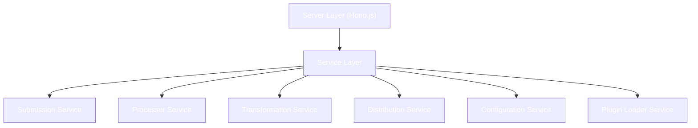

<!-- markdownlint-disable MD014 -->
<!-- markdownlint-disable MD033 -->
<!-- markdownlint-disable MD041 -->
<!-- markdownlint-disable MD029 -->

<div align="center">

<h1 style="font-size: 2.5rem; font-weight: bold;">curate.fun backend</h1>

  <p>
    <strong>Node.js/Hono.js backend service for the curate.fun platform</strong>
  </p>

</div>

<details>
  <summary>Table of Contents</summary>

- [Architecture Overview](#architecture-overview)
  - [Tech Stack](#tech-stack)
  - [Service Architecture](#service-architecture)
  - [Plugin System](#plugin-system)
- [Development](#development)
  - [Prerequisites](#prerequisites)
  - [Setup & Running](#setup--running)
  - [Testing](#testing)
- [Plugin Development](#plugin-development)

</details>

## Architecture Overview

### Tech Stack

- **Runtime**: Node.js with Bun for development
- **Framework**: Hono.js
- **Language**: TypeScript
- **Database**: File-based with DB service abstraction

### Service Architecture

The backend follows a service-oriented architecture with clear boundaries:



### Plugin System

The backend features a powerful plugin system with:

- Runtime module federation for dynamic loading
- Hot-reloading support
- Type-safe plugin configuration
- Custom endpoint registration
- Scheduled task integration

Supported plugin types:

- Source plugins (Twitter, Telegram, etc.)
- Transformer plugins (AI Transform, Simple Transform)
- Distributor plugins (Telegram, RSS, Notion, Supabase)

## Development

### Prerequisites

- [Bun](https://bun.sh) runtime installed (for development)
- Node.js 18+ (for production)
- Twitter API credentials (for content source)

### Setup & Running

1. Install dependencies:

```bash
bun install
```

2. Configure environment:

```bash
cp .env.example .env
```

3. Start development server:

```bash
bun run dev
```

### Testing

Run the test suite:

```bash
bun test
```

Run tests in watch mode during development:

```bash
bun test --watch
```

API documentation is available at `/swagger` when running the development server.

## Plugin Development

To develop new plugins for curate.fun, see the [Plugin Development Guide](../docs/docs/plugins/build-plugin.md).

Plugins can extend the platform in various ways:

- Add new content sources
- Create custom transformations
- Implement new distribution channels

The plugin system provides a standardized interface with type safety and comprehensive testing support.

<div align="right">
<a href="https://nearbuilders.org" target="_blank">

</a>
</div>
