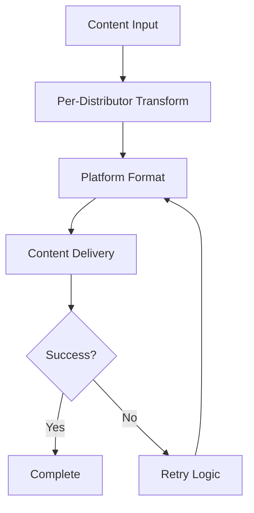

# 📤 Distribution System

The distribution system enables content delivery through various platform-specific plugins. Each distributor plugin handles the formatting and delivery of content to a specific platform or service.

## 🏗️ Architecture

### Distribution Pipeline

Content flows through three main stages:

1. **Pre-Distribution Transform**: Optional per-distributor content transformation
2. **Content Formatting**: Platform-specific content formatting
3. **Content Delivery**: Actual distribution to the target platform

### Configuration Placement

Distributors are configured in your `curate.config.json` under the feed's outputs section:

```json
{
  "feeds": [{
    "outputs": {
      "stream": {
        "distribute": [
          {
            "plugin": "@curatedotfun/telegram",
            "config": {
              // Distributor-specific configuration
            },
            "transform": [
              // Optional per-distributor transforms
            ]
          }
        ]
      }
    }
  }]
}
```

## 🔌 Available Distributors

- [Telegram](./telegram.md) - Send messages to Telegram channels
- [Notion](./notion.md) - Add entries to Notion databases
- [RSS](./rss.md) - Generate RSS feeds
- [Supabase](./supabase.md) - Store content in Supabase
- [NEAR Social](./near-social.md) - Post content to NEAR Social

## 🔒 Type Safety

Distributor plugins use TypeScript interfaces to ensure type safety:

```typescript
interface DistributorPlugin<TInput, TConfig> {
  distribute(args: { input: TInput, config: TConfig }): Promise<void>;
}

interface DistributionResult {
  success: boolean;
  error?: Error;
  metadata?: Record<string, any>;
}
```

## 🚀 Best Practices

1. **Use Per-Distributor Transforms** for platform-specific formatting
2. **Handle Rate Limits** for API-based distributors
3. **Implement Retries** for transient failures
4. **Monitor Distribution Status** for reliability
5. **Document Platform Requirements** for custom distributors

:::tip
Configure error handling and retries appropriately for each distributor to ensure reliable content delivery.
:::

## 🔄 Distribution Flow


